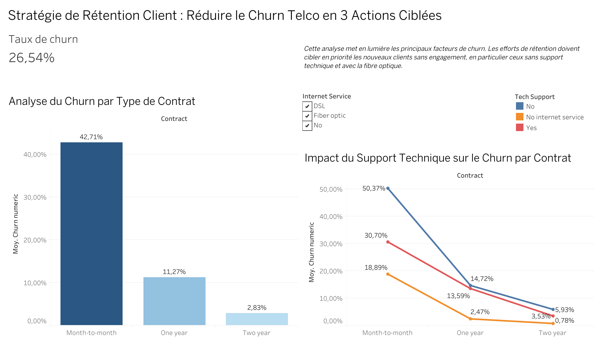

# Analyse du Churn Client pour "Telco"

## 1. Le Problème Business (La Demande)
Notre client, un opérateur "Telco", constate une perte de clients (churn) mais n'en comprend pas les causes exactes. L'objectif de ce projet n'est pas seulement de mesurer le taux de churn, mais de diagnostiquer les raisons principales du départ des clients et de proposer des recommandations stratégiques ciblées.

La question business est : "Qui part, pourquoi, et sur quels leviers devons-nous agir en priorité pour réduire l'attrition et maximiser notre revenu (MRR) ?"


## 2. Le Dashboard
Ce dashboard stratégique, conçu pour un public "non-technique" (type C-Level), résume l'analyse complète.




[Voir le Dashboard interactif sur Tableau Public](https://public.tableau.com/views/AnalyseChurnTelco-Milane11/Dashboard?:language=fr-FR&publish=yes&:sid=&:redirect=auth&:display_count=n&:origin=viz_share_link)

## 3. Les Données
Source : [Dataset "Telco Customer Churn" par IBM (disponible sur Kaggle)](https://www.kaggle.com/datasets/blastchar/telco-customer-churn?resource=download).

Contenu : ~7000 lignes de clients anonymisés.

Dimensions clés :

Infos Client : gender, SeniorCitizen, Partner, Dependents.

Infos Contrat : tenure (ancienneté), Contract, PaymentMethod, MonthlyCharges, TotalCharges.

Services Souscrits : PhoneService, InternetService (DSL, Fiber), OnlineSecurity, TechSupport, etc.

KPI Cible : Churn (Yes/No).

## 4. Plan d'Analyse & Hypothèses
Notre analyse sera guidée par la vérification des hypothèses suivantes :

### Hypothèses sur le Contrat et la Valeur
* H1 (Engagement) : Les clients avec un contrat Month-to-month (sans engagement) ont un taux de churn significativement plus élevé que les clients engagés sur 1 ou 2 ans.

* H2 (Prix) : À service égal, les clients ayant les MonthlyCharges les plus élevées sont plus susceptibles de partir.

* H3 (Ancienneté) : Le churn est plus concentré chez les nouveaux clients (ancienneté tenure < 12 mois) que chez les clients fidèles.

### Hypothèses sur le Produit et le Service
* H4 (Support Technique) : Les clients n'ayant pas souscrit au service TechSupport churnent davantage, car ils sont plus susceptibles d'être frustrés par des problèmes techniques.

* H5 (Type d'Internet) : Le type d'accès internet Fiber optic (plus cher/moderne) génère un churn différent (peut-être plus élevé à cause d'instabilité ou de prix) que le DSL.

### Hypothèses sur la Démographie
* H6 (Démographie) : Le statut SeniorCitizen influence le comportement de churn (par exemple, moins de tolérance aux problèmes techniques ou sensibilité au prix).

## 5. La Démarche Analytique

Voici les étapes qui ont mené à cette recommandation :

### A. Exploration & Nettoyage (SQL & Python)
Les données (7000 clients) ont été chargées d'un CSV vers une base de données SQLite pour simuler un environnement de production.

Les premières explorations (KPIs, hypothèses) ont été faites en SQL.

Exemple de requête SQL (H1 - Churn par Contrat) :

```SQL
SELECT
    Contract,
    ROUND(AVG(CASE WHEN Churn = 'Yes' THEN 1 ELSE 0 END) * 100, 2) AS churn_rate_percentage
FROM customers
GROUP BY Contract;
```
Le nettoyage final (gestion des `NaN` sur `TotalCharges` pour les clients `tenure=0`) et l'analyse visuelle (EDA) ont été faits en Python (Pandas, Seaborn).

### B. Analyse Diagnostique (Les "Insights")
L'analyse a révélé 3 "drivers" majeurs du churn :

L'Engagement (Contrat) : Les clients `Month-to-month` partent 15 fois plus que les clients engagés 2 ans (42,7% vs 2,8%).

Le Type de Service : Les clients `Fiber optic` ont un taux de churn paradoxalement élevé (41,9%), suggérant des problèmes de service plutôt que de prix.

Le Support : L'absence de `TechSupport` est un facteur aggravant majeur.

## 6. Recommandations Stratégiques  
Basé sur le dashboard, voici 3 actions ciblées pour réduire le churn :

* Action Urgente : Lancer une campagne de rétention immédiate pour les clients `Month-to-month` + `Fiber optic` + `No TechSupport` (le groupe à 50%+ de churn).
    * Offre : Proposer 6 mois de `TechSupport` gratuit.

* Action Court Terme : Créer des offres promotionnelles pour faire basculer les clients `Month-to-month` vers un contrat `One year` (ex: 1 mois offert).

* Action Long Terme : Lancer une enquête qualitative auprès des clients `Fiber optic` qui ont "churné" pour comprendre la cause racine (prix ? instabilité ? installation ?).

## 7. Installation 
Toutes les dépendances Python nécessaires sont listées dans le fichier `requirements.txt`.

### Comment lancer ce projet localement :

```bash
# 1. Clonez le dépôt
git clone https://github.com/caphey/telco-churn-analysis.git
cd telco-churn-analysis
```

```bash
# 2. Créez et activez l'environnement virtuel
python3 -m venv venv
source venv/bin/activate
```
```bash
# 3. Installez les dépendances
pip install -r requirements.txt
```
```bash
# 4. Lancez le notebook d'analyse
jupyter lab analyse_churn_telco.ipynb
```
## 8. La Stack Technique
Stockage/Requêtage : SQLite

Analyse & Nettoyage : Python (Pandas, NumPy).

Visualisation & EDA : Matplotlib / Seaborn.

Dashboarding & Storytelling : Tableau.